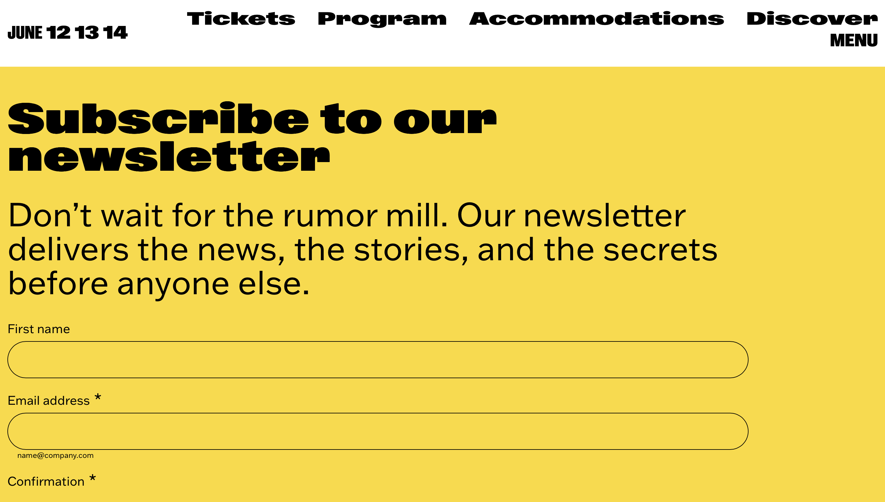
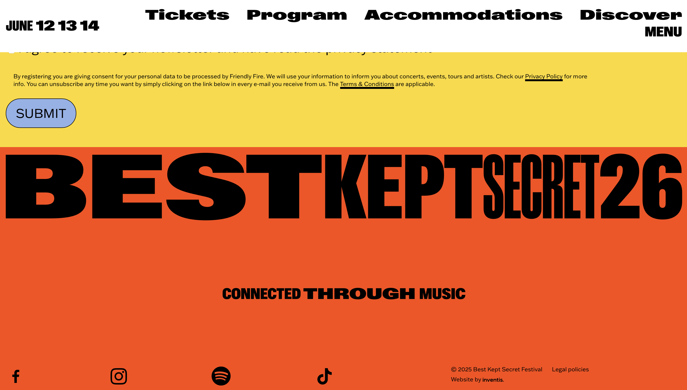
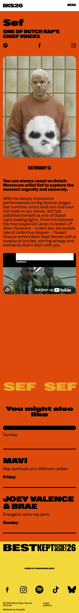
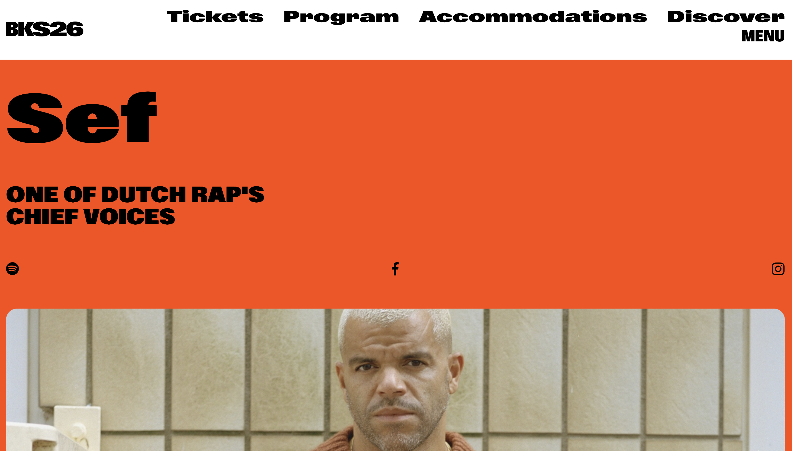
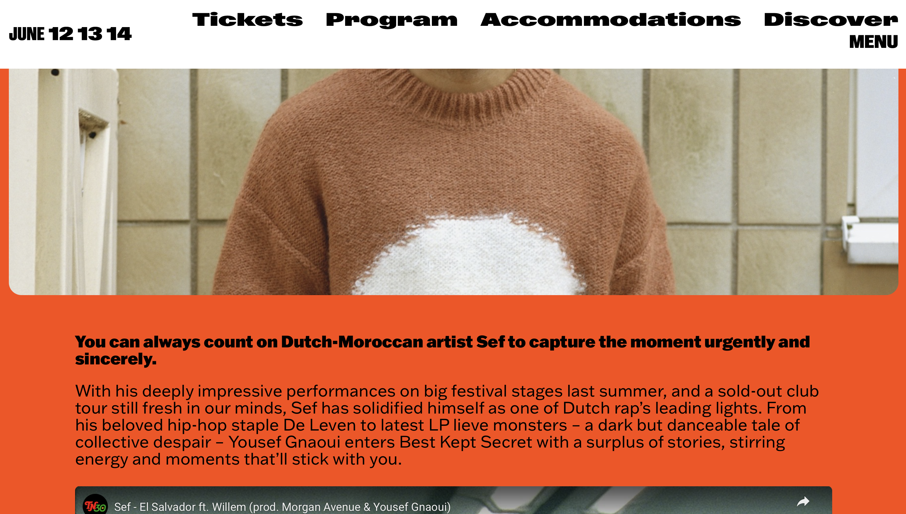
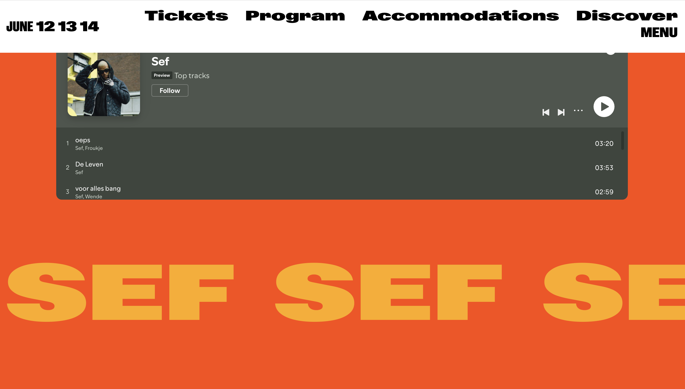
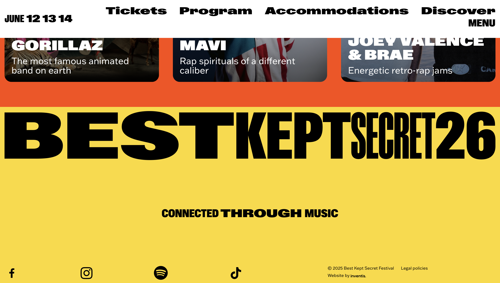

# Procesverslag
Markdown is een simpele manier om HTML te schrijven.  
Markdown cheat cheet: [Hulp bij het schrijven van Markdown](https://github.com/adam-p/markdown-here/wiki/Markdown-Cheatsheet).

Nb. De standaardstructuur en de spartaanse opmaak van de README.md zijn helemaal prima. Het gaat om de inhoud van je procesverslag. Besteedt de tijd voor pracht en praal aan je website.

Nb. Door *open* toe te voegen aan een *details* element kun je deze standaard open zetten. Fijn om dat steeds voor de relevante stuk(ken) te doen.

## Jij

  
uitwerken voor kick-off werkgroep

  ### Auteur:
  Livia Rosenthal

  #### Je startniveau:
  Blauw 

  #### Je focus:
  surface
 

## Je website

  
uitwerken voor kick-off werkgroep

  ### Je opdracht:
  https://www.bestkeptsecret.nl

  #### Screenshot(s) van de eerste pagina (small screen): 
  hier de naam van de pagina  
  
  
  
  
  
  

  #### Screenshot(s) van de tweede pagina (small screen):
  
  
  
  
  
  
  
 

## Toegankelijkheidstest 1/2 (week 1)

  
uitwerken na test in 2e werkgroep

  ### Bevindingen
  Lijst met je bevindingen die in de test naar voren kwamen:
  test met voorwerpen voor fysieke aandoening: 
  met twee vingers aan elkaar vast gaat scrollen moeilijk. het gaat haperend. Zijkant scrollen gaat wel prima, maar ook niet soepel. Klikken gaat goed, daar kan je de oppervlakte van je vingers prima voor gebruiken. 

  met het schokapparaat is het bijna onmogelijk. je beweeft dan heel erg op en neer. wanneer het apparaat op kleine schokjes staat is er nog wel wat mogelijk, maar dan klik je vaak op de touchpad. scrollen gaat dan nog wel. 

  Test met screenreader
  De screenreader op de eerste pagina is best wel goed. alles wordt voorgelezen. bij de lopende balk gaat de screenreader wel steeds dezelde dingen herhalen, ook bij het inschrijven voor de nieuwletter loopt ie vast wanneer je een vakje moet aanvinken. dat kan je oplossen door control+optie+spatie in te drukken, maar dit wordt niet benoemt. zelfde geldt voor wanneer je niet iets invult in een balk. de balk wordt rood, maar dat wordt niet benoemt. de screenreader stopt daarna met praten. ik zie geen aanwijzing hoe je het verder kan laten gaan. van boven naar beneden scrollen was goed, horizontaal niet.  

  op pagina twee is de screenreader ook best oke. hier wordt alles voorgelezen. ook alle iconen met linkjes worden voorgelezen. Het menu wordt uitgelegd. ook de eerste nummers in de spotifylijst worden benoemt. maar daarna loopt ie wel weer vast bij de zijwaarse balk. daar benoemt de screenreader vaak wat er staat. ook op het einde doet ie gek. want daar wordt de hele beschrijving benoemt van de afbeelding. van boven naar beneden scrollen was goed, horizontaal niet.  

## Breakdownschets (week 1)

  
uitwerken na afloop 3e werkgroep

  ### de hele pagina: 
  

  ### dynamisch deel (bijv menu): 
  

  ### wellicht nog een dynamisch deel (bijv filter): 
  

## Voortgang 1 (week 2)

  
uitwerken voor 1e voortgang

  ### Stand van zaken
  hier dit ging goed & dit was lastig (neem ook screenshots op van delen van je website en code)

  ### Agenda voor meeting
  samen met je groepje opstellen

  | student 1      | student 2          | student 3    | student 4        |
  | ---            | ---                | ---          | ---              |
  | dit bespreken  | en dit             | en ik dit    | en dan ik dat    |
  | en dat ook nog | dit als er tijd is | nog een punt | dit wil ik zeker |
  | ...            | ...                | ...          | ...              |

  ### Verslag van meeting
  hier na afloop snel de uitkomsten van de meeting vastleggen

  - punt 1
  - punt 2
  - nog een punt
  - ...

## Voortgang 2 (week 3)

  
uitwerken voor 2e voortgang

  ### Stand van zaken
  hier dit ging goed & dit was lastig (neem ook screenshots op van delen van je website en code)

  ### Agenda voor meeting
  samen met je groepje opstellen

  | student 1      | student 2          | student 3    | student 4        |
  | ---            | ---                | ---          | ---              |
  | dit bespreken  | en dit             | en ik dit    | en dan ik dat    |
  | en dat ook nog | dit als er tijd is | nog een punt | dit wil ik zeker |
  | ...            | ...                | ...          | ...              |

  ### Verslag van meeting
  hier na afloop snel de uitkomsten van de meeting vastleggen

  - punt 1
  - punt 2
  - nog een punt
- ...

## Toegankelijkheidstest 2/2 (week 4)

  
uitwerken na test in 9e werkgroep

  ### Bevindingen
  Lijst met je bevindingen die in de test naar voren kwamen (geef ook aan wat er verbeterd is):

## Voortgang 3 (week 4)

  
uitwerken voor 3e voortgang

  ### Stand van zaken
  hier dit ging goed & dit was lastig (neem ook screenshots op van delen van je website en code)

  ### Agenda voor meeting
  samen met je groepje opstellen

  | student 1      | student 2          | student 3    | student 4        |
  | ---            | ---                | ---          | ---              |
  | dit bespreken  | en dit             | en ik dit    | en dan ik dat    |
  | en dat ook nog | dit als er tijd is | nog een punt | dit wil ik zeker |
  | ...            | ...                | ...          | ...              |

  ### Verslag van meeting
  hier na afloop snel de uitkomsten van de meeting vastleggen

  - punt 1
  - punt 2
  - nog een punt
  - ...

## Eindgesprek (week 5)

  
uitwerken voor eindgesprek

  ### Je uitkomst - karakteristiek screenshots:
  

  ### Dit ging goed/Heb ik geleerd: 
  Korte omschrijving met plaatjes

  

  ### Dit was lastig/Is niet gelukt:
  Korte omschrijving met plaatjes

  

## Bronnenlijst

  
continu bijhouden terwijl je werkt

  Nb. Wees specifiek ('css-tricks' als bron is bijv. niet specifiek genoeg). 
  Nb. ChatGpT en andere AI horen er ook bij.
  Nb. Vermeld de bronnen ook in je code.

  1. bron 1
  2. bron 2
  3. ...

