# Procesverslag
Markdown is een simpele manier om HTML te schrijven.  
Markdown cheat cheet: [Hulp bij het schrijven van Markdown](https://github.com/adam-p/markdown-here/wiki/Markdown-Cheatsheet).

Nb. De standaardstructuur en de spartaanse opmaak van de README.md zijn helemaal prima. Het gaat om de inhoud van je procesverslag. Besteedt de tijd voor pracht en praal aan je website.

Nb. Door *open* toe te voegen aan een *details* element kun je deze standaard open zetten. Fijn om dat steeds voor de relevante stuk(ken) te doen.

## Jij

  
uitwerken voor kick-off werkgroep

  ### Auteur:
  Livia Rosenthal

  #### Je startniveau:
  Blauw 

  #### Je focus:
  surface
 

## Je website

  
uitwerken voor kick-off werkgroep

  ### Je opdracht:
  https://www.bestkeptsecret.nl

  #### Screenshot(s) van de eerste pagina (small screen): 
  hier de naam van de pagina  
  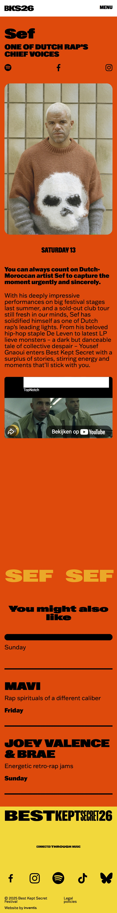

  #### Screenshot(s) van de tweede pagina (small screen):
  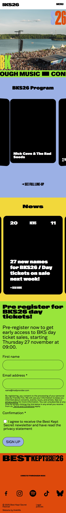
  
 

## Toegankelijkheidstest 1/2 (week 1)

  
uitwerken na test in 2e werkgroep

  ### Bevindingen
  Lijst met je bevindingen die in de test naar voren kwamen:
  test met voorwerpen voor fysieke aandoening: 
  met twee vingers aan elkaar vast gaat scrollen moeilijk. het gaat haperend. Zijkant scrollen gaat wel prima, maar ook niet soepel. Klikken gaat goed, daar kan je de oppervlakte van je vingers prima voor gebruiken. 

  met het schokapparaat is het bijna onmogelijk. je beweeft dan heel erg op en neer. wanneer het apparaat op kleine schokjes staat is er nog wel wat mogelijk, maar dan klik je vaak op de touchpad. scrollen gaat dan nog wel. 

  Test met screenreader
  De screenreader op de eerste pagina is best wel goed. alles wordt voorgelezen. bij de lopende balk gaat de screenreader wel steeds dezelde dingen herhalen, ook bij het inschrijven voor de nieuwletter loopt ie vast wanneer je een vakje moet aanvinken. dat kan je oplossen door control+optie+spatie in te drukken, maar dit wordt niet benoemt. zelfde geldt voor wanneer je niet iets invult in een balk. de balk wordt rood, maar dat wordt niet benoemt. de screenreader stopt daarna met praten. ik zie geen aanwijzing hoe je het verder kan laten gaan. van boven naar beneden scrollen was goed, horizontaal niet.  

  op pagina twee is de screenreader ook best oke. hier wordt alles voorgelezen. ook alle iconen met linkjes worden voorgelezen. Het menu wordt uitgelegd. ook de eerste nummers in de spotifylijst worden benoemt. maar daarna loopt ie wel weer vast bij de zijwaarse balk. daar benoemt de screenreader vaak wat er staat. ook op het einde doet ie gek. want daar wordt de hele beschrijving benoemt van de afbeelding. van boven naar beneden scrollen was goed, horizontaal niet.  

  WCAG checklist 1.0 (uitgevoerd door David)
    
    
    
    
    

  Meest opvallende dingen: 
  - geen lang attribuut
  - niet elke pagina heeft een unieke titel
  - Staat een <ol> ipv <ul>
  - onduidelijke alt teksten bij img
  - niet mogelijk om met de pijltjestoetsen door de linkjes heen te gaan
  - decoratieve img's hebben geen lege alt teksten
  - Video heeft geen beschrijving
  - geen dark/light mode
  - Geen focus state

  

## Breakdownschets (week 1)

  
uitwerken na afloop 3e werkgroep

  ### de hele pagina: 
  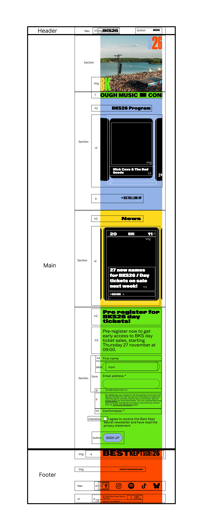

  ### de hele pagina: 
  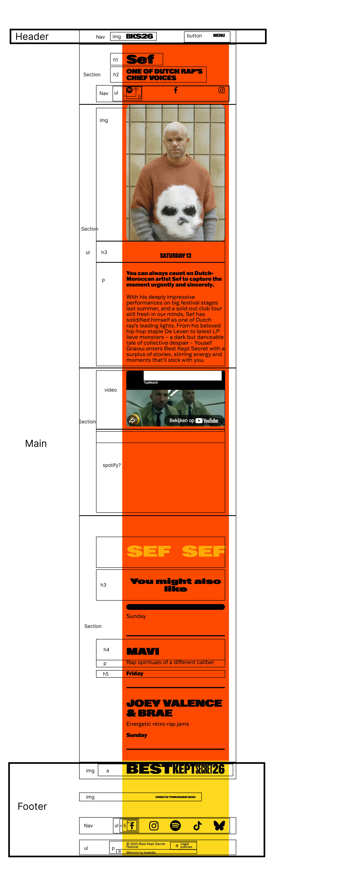

  ### dynamisch deel (bijv menu): 
  

  ### wellicht nog een dynamisch deel (bijv filter): 
  

## Voortgang 1 (week 2)

  
uitwerken voor 1e voortgang

  ### Stand van zaken
  hier dit ging goed & dit was lastig (neem ook screenshots op van delen van je website en code)

  ### Agenda voor meeting
  samen met je groepje opstellen

  | student 1      | student 2          | student 3    | student 4        |
  | ---            | ---                | ---          | ---              |
  | dit bespreken  | en dit             | en ik dit    | en dan ik dat    |
  | en dat ook nog | dit als er tijd is | nog een punt | dit wil ik zeker |
  | ...            | ...                | ...          | ...              |

  ### Verslag van meeting
  bij het eerste voorgangsgesprek werd er vooral gefocust op de html structuur. Bij mij was die bijna helemaal volledig. Er zaten een paar foutjes in, zoals een h3 die geen h3 moest zijn, maar een p. 

## Voortgang 2 (week 3)

  
uitwerken voor 2e voortgang

  ### Stand van zaken
  hier dit ging goed & dit was lastig (neem ook screenshots op van delen van je website en code)

  ### Agenda voor meeting
  samen met je groepje opstellen

  | student 1      | student 2          | student 3    | student 4        |
  | ---            | ---                | ---          | ---              |
  | dit bespreken  | en dit             | en ik dit    | en dan ik dat    |
  | en dat ook nog | dit als er tijd is | nog een punt | dit wil ik zeker |
  | ...            | ...                | ...          | ...              |

  ### Verslag van meeting
  Bij voortgang 2 had ik een paar vragen opgesteld, dat ging vooral over hoever het overeen moest komen met de originele website. en ik had een vraag over de nav. Bleek dat ik de maten niet goed had gezet. 

## Toegankelijkheidstest 2/2 (week 4)

  
uitwerken na test in 9e werkgroep

  ### Bevindingen
  Lijst met je bevindingen die in de test naar voren kwamen (geef ook aan wat er verbeterd is):
  
  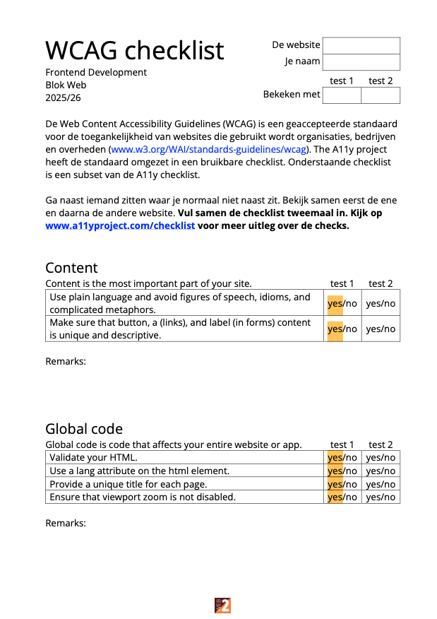
  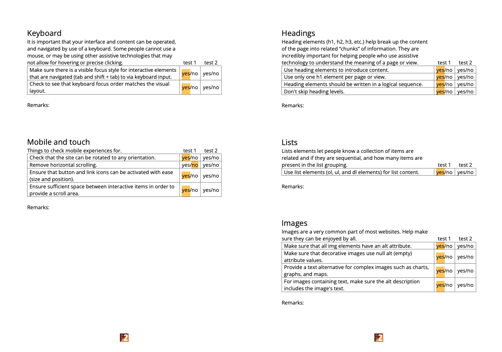
  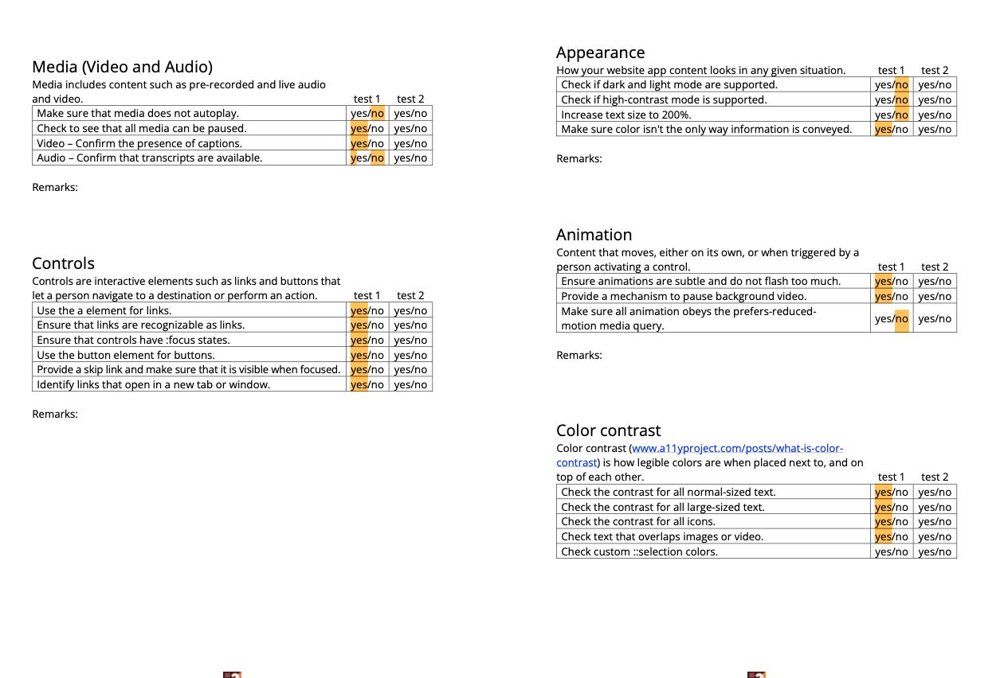

  - HTML is semantisch correct
  - duidelijke alt teksten bij alle img's
  - video heeft beschrijving 
  - lang attribuut is aanwezig
  - elke pagina heeft een unieke titel
  - er is focus state
  - lijsten staan in ul ipv ol 

## Voortgang 3 (week 4)

  
uitwerken voor 3e voortgang

  ### Stand van zaken
  hier dit ging goed & dit was lastig (neem ook screenshots op van delen van je website en code)

  ### Agenda voor meeting
  samen met je groepje opstellen

  | student 1      | student 2          | student 3    | student 4        |
  | ---            | ---                | ---          | ---              |
  | dit bespreken  | en dit             | en ik dit    | en dan ik dat    |
  | en dat ook nog | dit als er tijd is | nog een punt | dit wil ik zeker |
  | ...            | ...                | ...          | ...              |

  ### Verslag van meeting
 bij dit voorgangsgeprek was ik niet bij. 

## Eindgesprek (week 5)

  
uitwerken voor eindgesprek

  ### Je uitkomst - karakteristiek screenshots:
  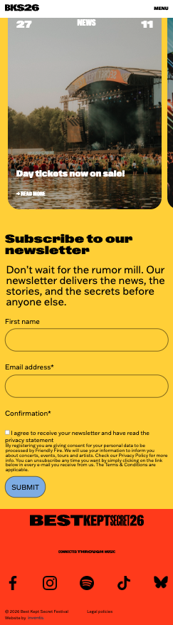
  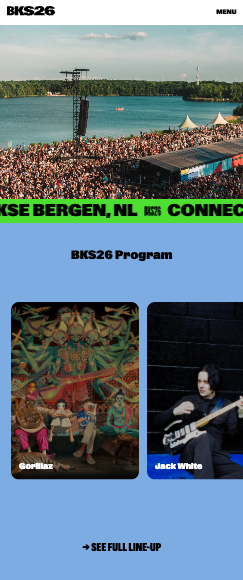
  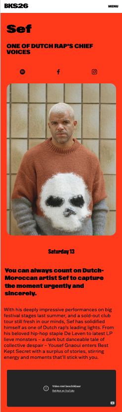
  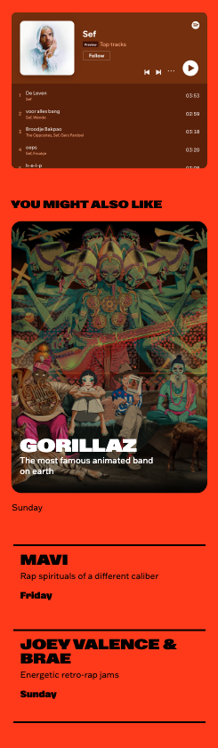
  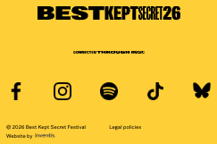

  ### Dit ging goed/Heb ik geleerd: 
  Ik vind dit een super lastig vak en ik ben dus eigenlijk best blij met veel van wat ik heb gemaakt. 
  Maar om er twee uit te lichten; Ik ben tevreden over hoe het menu is uitgepakt en vooral omdat ik dacht dat het veel lastiger zou zijn. 
  Ook ben ik tevreden over de horizontale groene balk op de homepagina. met hulp van bronnen en zelf goed nadenken 
  is dat gelukt.  

  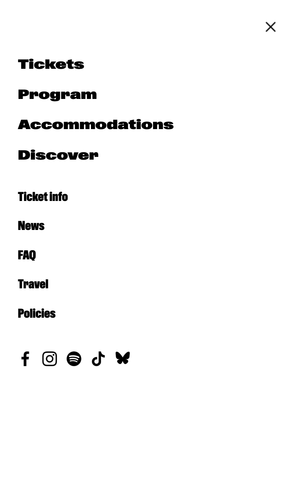
  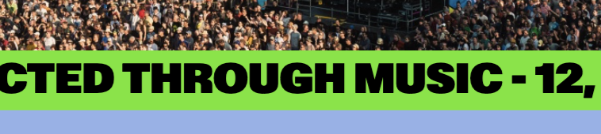

  ### Dit was lastig/Is niet gelukt:
  Helaas is het mij niet gelukt om de letters op de grote afbeelding te zetten bij de homepage. Ook zijn meerdere animaties niet gelukt. Ik wilde graag dat er een border ontstond onder de h3 bij de carrousels, ook wilde ik 
  een wishlist op de Gorillaz afbeelding op de sef pagina. En ik wilde dat wanneer je naar beneden scrollt het logo veranderde naar een ander logo en de horizontale balk op de Sef pagina.

  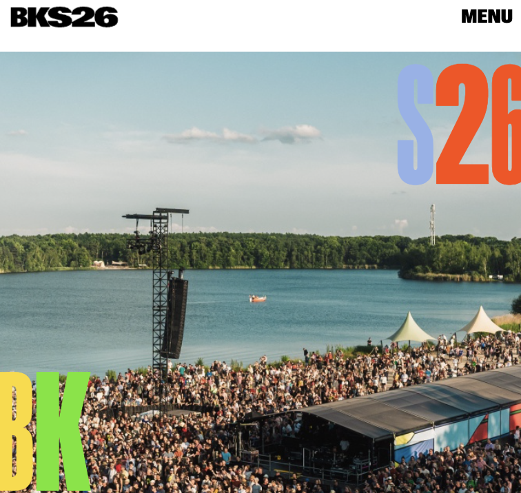
  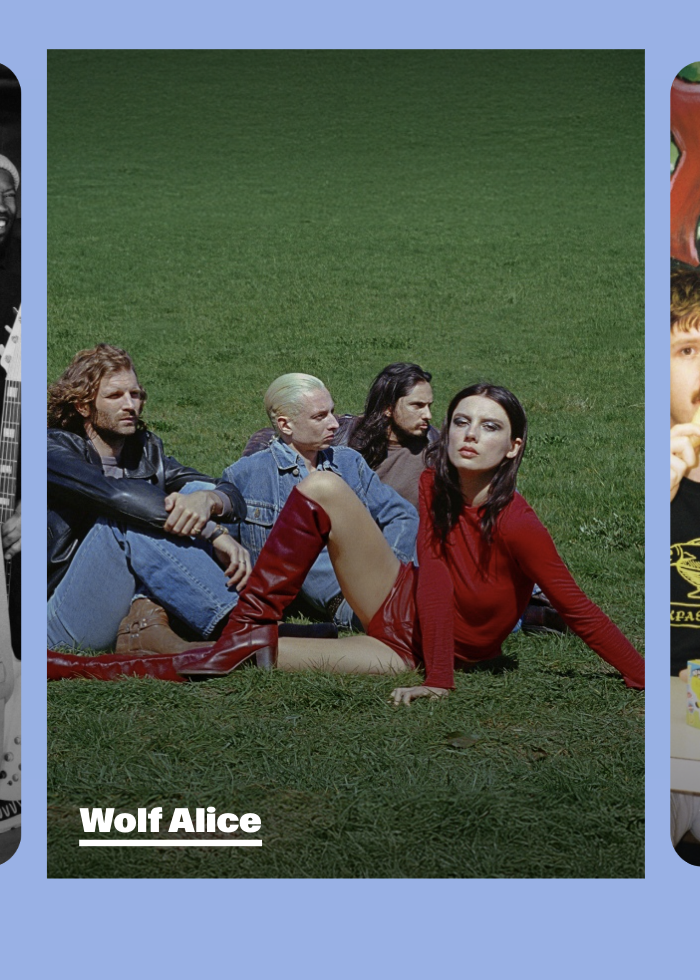
  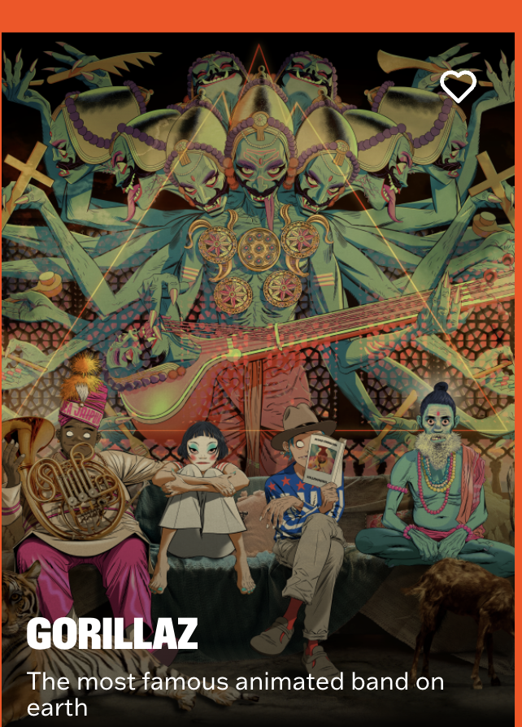
  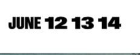
  

## Bronnenlijst

  
continu bijhouden terwijl je werkt

  Nb. Wees specifiek ('css-tricks' als bron is bijv. niet specifiek genoeg). 
  Nb. ChatGpT en andere AI horen er ook bij.
  Nb. Vermeld de bronnen ook in je code.

  1. bron 1 font toevoegen css: bron: https://developer.mozilla.org/en-US/docs/Web/CSS/Reference/At-rules/@font-face#description
  2. bron 2 menu: https://codepen.io/shooft/pen/myepoJo
  3. bron 3 youtube link uitleg van dlo voor @keyframes en animatie: https://www.youtube.com/watch?v=HZHHBwzmJLk
  4. bron:https://css-tricks.com/almanac/properties/w/whitespace/*/ > white-space: nowrap; /* zorgt dat de zin niet afgebroken wordt, 
  5. bron: https://codepen.io/shooft/pen/QwjQGZe */scroll-snap-type: x mandatory; /* daardoor springt de img naar het midden nadat je klaar bent met scrollen. 
  6. bron:https://developer.mozilla.org/en-US/docs/Web/CSS/Reference/Properties/font-stretchfont-stretch: expanded;  
  7. bron: https://developer.mozilla.org/en-US/docs/Web/HTML/Reference/Elements/input/checkboxform input[type="checkbox"]  > ik wist niet hoe je de checkbox moest aanspreken
  8. bron: https://chatgpt.com/share/69767af4-4a6c-800f-831e-679d2a318f8e > ik kreeg de ul niet in het midden gecentreerd, heb dit gevraagd aan ai en die kwam met oplossing margin inline
  9. bron: https://developer.mozilla.org/en-US/docs/Web/CSS/Reference/Values/filter-function/brightness*/ filter: brightness(80%); 
  10. bron formulier: https://www.w3schools.com/html/html_forms.asp
  11. bron uitleg Iframe youtube video plakken in code:https://support.google.com/youtube/answer/171780?hl=en 
  12. bron uitleg Iframe spotify player :https://developer.spotify.com/documentation/embeds/tutorials/creating-an-embed   
  13. 14. 15. 16. 17.  Formulier email adress animatie > 
  bron :invalid: https://developer.mozilla.org/en-US/docs/Web/CSS/Reference/Selectors/:invalid
  bron :placeholder-shown: https://developer.mozilla.org/en-US/docs/Web/CSS/Reference/Selectors/:placeholder-shown
  bron :focus: https://developer.mozilla.org/en-US/docs/Web/CSS/Reference/Selectors/:focus
  bron type=email: https://developer.mozilla.org/en-US/docs/Web/HTML/Element/input/email  
  bron keyframes: https://developer.mozilla.org/en-US/docs/Web/CSS/Reference/At-rules/@keyframes    
  18. bron https://developer.mozilla.org/en-US/docs/Web/CSS/Reference/Values/filter-function/invert > om de svg pauzeknop kleur te geven  
  19. vanuit de bron https://developers.google.com/youtube/player_parameters  een links samen laten stellen door ai. screenshot uit het gesprek: 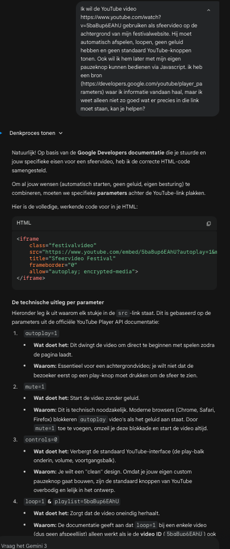
  20. bron :focus-within: https://developer.mozilla.org/en-US/docs/Web/CSS/Reference/Selectors/:focus-within
  21. om een youtube video te besturen> bron: MDN Web Docs - window.postMessage() en contentWindow
  22. het verstuurde bericht ('{"event":"command","func":"pauseVideo","args":""}', '*') bron: Google Developers - YouTube Iframe API Reference    
  

